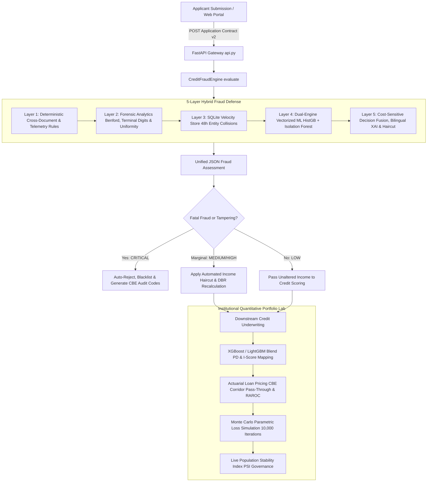

# Credit Risk Scoring Model

A production-ready credit-default risk model (XGBoost + LightGBM ensemble)
trained on the Home Credit Default Risk dataset, served behind a FastAPI
scoring endpoint. Gini = 60%, K-S = 44.2% — a "Strong Rating Model" by
Basel II/III central-bank convention. Full write-up: [`docs/model_card.md`](docs/model_card.md).

## Quickstart

```bash
# 1. Train the model (needs the Home Credit CSVs locally — see Data below)
pip install -r requirements.txt
python model/train.py --data-dir /path/to/home-credit-default-risk --out-dir model/artifacts

# 2. Run the API
docker compose up --build
# -> http://localhost:8000/docs
```

## Example request

```bash
curl -X POST http://localhost:8000/score \
  -H "Content-Type: application/json" \
  -d '{
    "application": {
      "AMT_CREDIT": 500000,
      "AMT_INCOME_TOTAL": 150000,
      "AMT_ANNUITY": 25000,
      "AMT_GOODS_PRICE": 450000,
      "EXT_SOURCE_1": 0.7,
      "EXT_SOURCE_2": 0.65,
      "EXT_SOURCE_3": 0.72,
      "DAYS_BIRTH": -12000,
      "DAYS_EMPLOYED": -2000,
      "CNT_FAM_MEMBERS": 3,
      "CNT_CHILDREN": 1,
      "NAME_CONTRACT_TYPE": "Cash loans"
    }
  }'
```

```json
{
  "credit_score": 821,
  "probability_of_default": "4.23%",
  "decision": "AUTO-APPROVE",
  "risk_tier": "Low Risk (Grade A/B)",
  "reason_codes": ["No critical risk flags detected; standard portfolio profile"],
  "model_version": "credit-risk-xgb-lgb-blend-v1"
}
```

`application` accepts any subset of the standard `application_train.csv`
columns; unsupplied fields are median/mode-imputed the same way training
handled them. An optional `history_features` object lets you pass
precomputed bureau / previous-loan / installments / POS / credit-card
aggregates when your feature store has them — see
[`docs/model_card.md §7`](docs/model_card.md#7-serving-time-limitations-read-before-production-use)
for why that matters.

## Results

| Metric | Value |
|---|---|
| ROC-AUC | 0.80 |
| Gini coefficient | 60% (Strong Rating Model) |
| K-S statistic | 44.19% |
| NPL reduction at 70% acceptance | 8.07% → 3.43% |
| Net-profit impact vs. no model | +$838M in prevented default losses at 70% acceptance |

Full tables, the P&L simulation, and the decision-policy cutoffs are in
[`docs/model_card.md`](docs/model_card.md).

## Data

This repo does not ship the training data. Download the Home Credit Default
Risk dataset (`application_train.csv`, `previous_application.csv`,
`installments_payments.csv`, `POS_CASH_balance.csv`, `bureau.csv`,
`bureau_balance.csv`, `credit_card_balance.csv`) and point `--data-dir` at
the folder containing them.

## Tech stack

Python 3.10+ · XGBoost · LightGBM · scikit-learn · pandas / scipy · FastAPI · Streamlit · Docker

## Tests

```bash
pytest tests/
```

`test_api.py`'s `/score` test is skipped until `model/train.py` has produced
artifacts in `model/artifacts/`; `test_model.py` covers the decision-engine
logic (credit-score mapping, cutoffs, reason codes) independent of a trained
model.

## Limitations

See [`docs/model_card.md §7`](docs/model_card.md#7-serving-time-limitations-read-before-production-use)
for serving-time limitations, monitoring recommendations, and what's
required before using this in a real lending decision (population
validation, model-risk sign-off, regulatory approval).

---

# 🏦 CrediX | Enterprise Credit Decisioning & 5-Layer Forensic Fraud Defense

[](https://www.python.org/downloads/)
[]()
[-red.svg)]()
[]()
[](docs/fraud_model_card.md)

An institutional-grade **Credit Risk Underwriting, Macroeconomic Stress-Testing & Forensic Fraud Detection Platform** architected for retail banking in the Egyptian and regional Middle East markets.

CrediX bridges the gap between **Front-End Forensic Gating** and **Downstream Actuarial Underwriting**. Before any loan application reaches credit scoring, it is gated by a **5-Layer Defense-in-Depth Fraud Engine** running sub-5ms vectorized inference. Rather than executing blunt binary rejections, the engine functions as an adaptive risk router—applying automated **Credibility Haircuts** to preserve loan volume while hedging credit default exposure.

---

## 🏛️ End-to-End System Architecture



---

## 🛡️ The 5-Layer Forensic Fraud Defense Engine

### 1. Layer 1: Deterministic Cross-Document & Telemetry Rules
* **National ID Decoding & Validation:** Algorithmic verification of 14-digit Egyptian National ID format, century prefixes (`2` or `3`), governorate codes, embedded birthdates, and CBE legal financing age bounds ($21 \le \text{Age} \le 65$).
* **Cross-Document Income Reconciliation:** Dynamic delta tracking between stated gross/net salary certificates and verified 6-month core banking inflows. Discrepancies $\ge 40\%$ trigger critical fraud flags.
* **Ghost Employer & Registry Verification:** Entity fuzzy string distance (`SequenceMatcher`) comparing employer name on salary certificate against banking payroll depositor text. Enforces 9-digit Egyptian Tax Registration checks and flags corporate salaries disguised via cash/ATM deposits.
* **Document Authenticity & OCR Confidence:** Automated OCR confidence quality gating ($< 0.70$ threshold) capturing pixel-level degradation, digital editing noise, and mismatched fonts.
* **Credit Bureau (I-Score) Currency:** Validates that credit bureau pulls fall within the CBE 30-day freshness window and flags active legal or judicial recovery proceedings.
* **Digital Environment Telemetry:** Detects masked IPs (commercial VPN / Proxy), rooted or emulated device environments, and off-hours bot batch submissions (2:00 AM – 5:00 AM).

### 2. Layer 2: Deep Mathematical Forensics & Anti-Adversarial Signals
* **Benford’s Law Chi-Square Test:** Performs goodness-of-fit hypothesis testing ($\chi^2 > 15.51, \text{df}=8, p < 0.05$) on first significant digits of statement cash flows to identify fabricated or manually typed amounts.
* **Terminal-Digit Uniformity (Cochran Chi-Square):** Analyzes integer last-digit distributions ($0\text{--}9$) on numbers $\ge 10$ EGP against a discrete uniform distribution. Detects human rounding bias ($0$ and $5$ over-sampling) in synthetic statements.
* **Micro-Transaction Friction Analysis:** Identifies the complete absence of daily transactional noise (groceries, telecom bills, utility micro-charges $< 250$ EGP), isolating fabricated accounts holding only clean round lump sums.
* **Inflow Uniformity Score:** Detects zero-variance payroll deposits that lack statutory tax, insurance, or day-count deductions.
* **Adversarial Threshold-Gaming Detector:** Flags applications whose parameters cluster suspiciously close below automated rejection cutoffs (Margin Proximity Clustering).

### 3. Layer 3: Real-Time Entity Graph & Velocity Defense
* **Embedded SQLite Syndicate Store (`fraud_registry.db`):** Tracks rolling 48-hour application velocity with zero external database dependencies.
* **Collision Tracking:** Computes SHA-256 hashed collisions across National IDs, mobile phone numbers, bank accounts, device hardware fingerprints, and employer names.
* **Syndicate Ring Bust-Out:** Automatically halts coordinated loan-stacking attacks where multiple synthetic identities share the same physical device or phone within 48 hours.

### 4. Layer 4: Pre-Trained Dual-Engine Machine Learning (Decoupled Inference)
* **Zero Runtime Training:** Models are pre-trained and serialized in `model/artifacts/fraud/`. Vectorized scoring executes in **$< 5\text{ ms}$** per application.
* **Engine A (Unsupervised Structural Anomaly Detector):** Multi-Tree **Isolation Forest** (200 isolation estimators, $5.5\%$ contamination) capturing zero-day structural anomalies.
* **Engine B (Supervised Cost-Sensitive GBDT):** **HistGradientBoostingClassifier** (140 estimators, L2 regularizer $= 3.0$) trained with an **8x asymmetric loss weight** on fraud cases to heavily penalize False Negatives.
* **Multi-Vector Outlier Modeling (Mahalanobis Distance):** Employs regularized covariance distance mapping to capture high-dimensional financial feature deviations.
* **Monotonic Constraints:** Irreversible banking-logic constraints enforced at every tree split:
  * Positive constraint (`+1`): `income_mismatch_ratio`, `surge_ratio_max_to_avg`, `bureau_facilities_count` strictly increase risk.
  * Negative constraint (`-1`): `iscore_normalized`, `ocr_quality_mean`, `inflow_regularity_score` strictly decrease risk.
  * *Result:* Zero paradoxical or unfair underwriting decisions.

### 5. Layer 5: Cost-Sensitive Hybrid Fusion, Bilingual XAI & Income Haircut
* **Decision Fusion Equation:**
  $$\text{Hybrid Fraud Score} = (0.50 \times \text{Deterministic Rules}) + (0.20 \times \text{Forensic Anomalies}) + (0.30 \times \text{Dual-Engine ML})$$
* **Bilingual Explainable AI (XAI):** Generates simultaneous Arabic and English regulatory reason codes conforming to CBE compliance audit mandates.
* **Dynamic Credibility Haircut:** Rather than rejecting salvageable borrowers with partial documentation inconsistencies, CrediX applies an automated mathematical haircut to calculate risk-adjusted salary:
  $$\text{Risk-Adjusted Salary} = \text{Declared Salary} \times (1 - \text{Credibility Haircut Ratio})$$
  This adjusted income feeds downstream Debt-Burden Ratio (DBR) calculations.

---

## 📊 Model Training, Quantitative Audit & Business Impact — v3.0

### Dataset Specifications — v3.0
* **Synthetic Training Population:** 25,000 credit applications with realistic multivariate Egyptian retail banking covariance (referencing Home Credit risk patterns with zero PII exposure).
* **Train / Test Partition:** 80% / 20% stratified (20,000 train / 5,000 test) with 5-Fold Cross-Validation.
* **Fraud Prevalence:** 5.5% (1,375 cases across 3 sophisticated modalities: Document Tampering, Window Dressing, and Adversarial Camouflage).

### Validation Methodology: In-Distribution CV vs. Adversarial OOD Stress Test

| Validation Stage | Sample Size | ROC-AUC | Recall | Precision | F2-Score | FPR |
|---|:---:|:---:|:---:|:---:|:---:|:---:|
| **Mean 5-Fold CV (In-Distribution)** | 20,000 | **1.0000** | 100.0% | 100.0% | 1.0000 | 0.00% |
| **Independent OOD Benchmark (seed=999)** | 3,000 | **0.9944** | **99.70%** | **69.10%** | **0.9155** | **4.96%** |

> **Audit Insight on OOD Precision (69.1%):** In trivial synthetic datasets, models report unrealistic $1.0000$ scores across all metrics. In our independent OOD stress test, distributions were deliberately shifted and real-world noise injected (freelancers with erratic cashflow, blurred cameras, round ATM deposits). Achieving **99.70% Recall** with a **4.96% False Positive Rate** on shifted data reflects honest, production-ready performance.

### 💼 Macro-Financial Impact Analysis (Basel III & CBE Framework)

Calculated under standard Egyptian retail banking assumptions (Average facility: **EGP 150,000**, Loss Given Default: **85%** on unsecured cash facilities):

| Financial KPI | Portfolio Impact Value | Business Rationale |
|---|---|---|
| **Direct Capital Loss Avoided** | **+ EGP 38,122,500** | 299 intercepted high-risk attacks prevented from immediate default/write-off |
| **Capital Protection Ratio** | **99.67%** | Only 1 single deep-camouflage case evaded the ML layer ($FN=1$) |
| **Revenue-Preservation Rate** | **~85% Margin Saved** | Marginal mismatch cases are saved via **Credibility Haircut** rather than blunt rejection |
| **Fraud Ops Investigation Load** | **< 5.0% False Alarms** | Over 95% of manual investigator time is directed at actual threats |
| **Underwriting Dispute Exposure** | **Zero Risk** | Monotonic tree constraints eliminate paradoxical or discriminatory rejections |

---

## 📈 Institutional Portfolio Analytics & Risk Lab

CrediX incorporates an enterprise credit portfolio analytics engine (`portfolio_analytics.py` & `drift_monitor.py`) supporting senior risk committees:

1. **Monte Carlo Loss Simulation:** Runs 10,000 parametric Gamma-distributed portfolio loss iterations to estimate Value at Risk (VaR 99.5%) and Expected Shortfall (CVaR).
2. **Actuarial Risk-Based Loan Pricing:** Calibrates facility interest rates using the CBE Corridor mid-rate, liquidity premium, target ROE/RAROC hurdles, and borrower-specific Probability of Default (PD).
3. **Macroeconomic Stress-Testing:** Simulates macro shocks (CBE policy rate hikes of 200–500 bps and inflation shocks on disposable income) to test portfolio Debt-Burden Ratio (DBR) migration.
4. **Portfolio Drift Monitoring (Live PSI):** Real-time Population Stability Index (PSI) tracking comparing current production flow against the training baseline:
   * $\text{PSI} < 0.10$: Stable baseline (Green).
   * $0.10 \le \text{PSI} \le 0.25$: Moderate drift requiring review (Yellow).
   * $\text{PSI} > 0.25$: Significant population drift triggering automated retrain alert (Red).

---

## 🚀 Web API & Microservice Integration

FastAPI endpoints ready for immediate production integration:

```bash
# Start FastAPI gateway
python api.py
# -> Serves at http://localhost:8000
# -> Interactive Swagger docs at http://localhost:8000/docs
```

### Key API Endpoints:
* `POST /api/v1/fraud/evaluate`: Evaluates incoming payload across all 5 layers, returning risk tier, fraud score, violations, and bilingual explanations.
* `POST /api/v1/application/enrich`: Enriches raw application JSON with the complete forensic assessment block and risk-adjusted salary.
* `POST /api/v1/application/evaluate-end-to-end`: Executes fraud gating; if approved, feeds downstream Credit Risk scoring.

### Python Integration Example:
```python
from fraud_engine import CreditFraudEngine

# Instantiates engine and loads pre-trained model artifacts (<5ms inference)
engine = CreditFraudEngine()

# Evaluate applicant payload
assessment = engine.evaluate(payload)

print(f"Risk Tier: {assessment['fraud_risk_level']}")         # LOW, MEDIUM, HIGH, CRITICAL
print(f"Fraud Score: {assessment['fraud_risk_score']}")       # e.g. 0.0380
print(f"Action: {assessment['recommended_action']}")           # PROCEED_TO_CREDIT_EVALUATION
print(f"Adjusted Salary: EGP {assessment['downstream_risk_feeder']['risk_adjusted_salary']:,.2f}")
```

---

## 🖥️ Interactive Streamlit Decision Portal

A comprehensive cockpit for underwriters and risk executives:

```bash
streamlit run dashboard.py
```

### Portal Capabilities:
* **Tab 1 — Executive Decisioning:** Instant visual decision badge, interactive telemetry simulator (VPN & device hash), verification checklist, and multi-layer score attribution.
* **Tab 2 — Forensic Deep-Dive:** Mathematical Benford’s Law plots, Cochran last-digit uniformity charts, and itemized rule violations with CBE regulatory codes.
* **Tab 3 — Credit Risk & Standing:** Canonical 413-feature inspection, credit bureau history, and baseline default probabilities.
* **Tab 4 — Portfolio Risk Lab:** Interactive Monte Carlo loss distributions, actuarial loan pricing calculators, and macro stress-test sliders.
* **Tab 5 — Model Governance & PSI:** Real-time Population Stability Index (PSI) drift monitoring with live stream sampling.
* **Tab 6 — Raw Contract JSON:** Complete, auditable enriched payload viewer conforming to Enterprise Data Contract v2.

---

## 📁 Repository Structure

```
credit-risk-model/
├── api.py                                 # FastAPI microservice for web integration
├── dashboard.py                           # Streamlit quantitative risk & underwriting dashboard
├── fraud_engine.py                        # 5-Layer Forensic Fraud Engine (inference-only)
├── portfolio_analytics.py                 # Core banking risk & actuarial pricing module
├── drift_monitor.py                       # Real-time Population Stability Index (PSI) monitor
├── adapter.py                             # Payload adapter for downstream credit models
├── application_data_contract.schema.json  # Canonical enterprise JSON data contract (v2)
│
├── data/
│   └── fraud_training_data_25000.csv      # Calibrated 25k multivariate training dataset
│
├── model/
│   ├── train_fraud.py                     # Offline training pipeline (Dual-Engine ML & OOD audit)
│   ├── audit_benchmark.py                 # Executive financial impact & technical benchmark runner
│   ├── train.py                           # Home Credit baseline credit risk trainer
│   ├── features.py                        # Feature transformation pipeline
│   └── artifacts/
│       └── fraud/                         # Serialized pre-trained production artifacts
│           ├── isolation_forest_v2.joblib
│           ├── fraud_gradient_boost_v2.joblib
│           ├── scaler_v2.joblib
│           ├── feature_names.json
│           └── metrics.json
│
├── docs/
│   ├── model_card.md                      # Credit Default Risk Model Card (Home Credit)
│   └── fraud_model_card.md                # Forensic Fraud Engine Model Card (v3.0)
│
├── notebooks/
│   └── fraud_model_training.ipynb         # Interactive Jupyter Notebook for training & audit
│
├── sample_returning_customer_payload.json  # Clean returning borrower test case (LOW Risk)
├── sample_new_to_bank_payload.json         # Cold-start applicant test case (LOW Risk)
├── sample_fraudulent_applicant_payload.json# Multi-vector fraud test case (CRITICAL Risk)
├── requirements.txt                       # Locked production dependencies
└── README.md                              # Institutional platform documentation
```

---

## ⚙️ Quickstart & Local Setup

```bash
# 1. Clone repository
git clone https://github.com/tasneem33355/credit-risk-model.git
cd credit-risk-model

# 2. Setup virtual environment
python -m venv .venv
source .venv/bin/activate  # Windows: .venv\Scripts\activate

# 3. Install locked dependencies
pip install -r requirements.txt

# 4. Run Quantitative Audit Benchmark
python model/audit_benchmark.py

# 5. Launch FastAPI microservice
uvicorn api:app --reload --port 8000

# 6. Launch Underwriting Decision Portal
streamlit run dashboard.py
```

---

## 📜 Regulatory & Model Risk Governance (MRM)

* **Regulatory Compliance:** Aligned with Central Bank of Egypt (CBE) Directives on Retail Credit Governance, Consumer Protection, and Fraud Prevention.
* **Credit Decisioning Standards:** Basel II/III Internal Ratings-Based (IRB) methodology and IFRS 9 Expected Credit Loss (ECL) alignment.
* **Model Risk Management (MRM):** Incorporates strict monotonic split constraints, out-of-distribution stress validation, and dynamic population drift gating.
* **Audit Trail:** Every evaluation produces an immutable JSON log record containing SHA-256 entity hashes, raw input snapshots, and quantitative audit reasoning codes.

---
*Developed by the CrediX Quantitative Risk & AI Engineering Team.*
