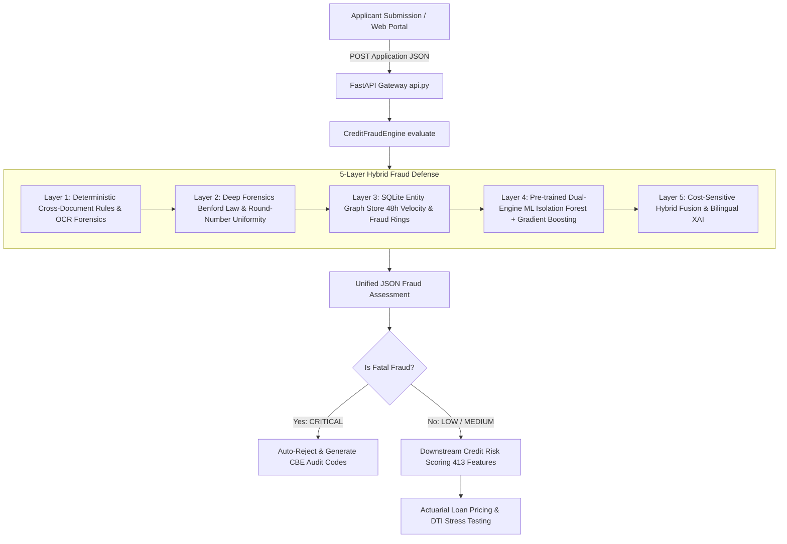

# Credit Risk Scoring Model

A production-ready credit-default risk model (XGBoost + LightGBM ensemble)
trained on the Home Credit Default Risk dataset, served behind a FastAPI
scoring endpoint. Gini = 60%, K-S = 44.2% — a "Strong Rating Model" by
Basel II/III central-bank convention. Full write-up: [`docs/model_card.md`](docs/model_card.md).

## Quickstart

```bash
# 1. Train the model (needs the Home Credit CSVs locally — see Data below)
pip install -r requirements.txt
python model/train.py --data-dir /path/to/home-credit-default-risk --out-dir model/artifacts

# 2. Run the API
docker compose up --build
# -> http://localhost:8000/docs
```

## Example request

```bash
curl -X POST http://localhost:8000/score \
  -H "Content-Type: application/json" \
  -d '{
    "application": {
      "AMT_CREDIT": 500000,
      "AMT_INCOME_TOTAL": 150000,
      "AMT_ANNUITY": 25000,
      "AMT_GOODS_PRICE": 450000,
      "EXT_SOURCE_1": 0.7,
      "EXT_SOURCE_2": 0.65,
      "EXT_SOURCE_3": 0.72,
      "DAYS_BIRTH": -12000,
      "DAYS_EMPLOYED": -2000,
      "CNT_FAM_MEMBERS": 3,
      "CNT_CHILDREN": 1,
      "NAME_CONTRACT_TYPE": "Cash loans"
    }
  }'
```

```json
{
  "credit_score": 821,
  "probability_of_default": "4.23%",
  "decision": "AUTO-APPROVE",
  "risk_tier": "Low Risk (Grade A/B)",
  "reason_codes": ["No critical risk flags detected; standard portfolio profile"],
  "model_version": "credit-risk-xgb-lgb-blend-v1"
}
```

`application` accepts any subset of the standard `application_train.csv`
columns; unsupplied fields are median/mode-imputed the same way training
handled them. An optional `history_features` object lets you pass
precomputed bureau / previous-loan / installments / POS / credit-card
aggregates when your feature store has them — see
[`docs/model_card.md §7`](docs/model_card.md#7-serving-time-limitations-read-before-production-use)
for why that matters.

## Results

| Metric | Value |
|---|---|
| ROC-AUC | 0.80 |
| Gini coefficient | 60% (Strong Rating Model) |
| K-S statistic | 44.19% |
| NPL reduction at 70% acceptance | 8.07% → 3.43% |
| Net-profit impact vs. no model | +$838M in prevented default losses at 70% acceptance |

Full tables, the P&L simulation, and the decision-policy cutoffs are in
[`docs/model_card.md`](docs/model_card.md).

## Data

This repo does not ship the training data. Download the Home Credit Default
Risk dataset (`application_train.csv`, `previous_application.csv`,
`installments_payments.csv`, `POS_CASH_balance.csv`, `bureau.csv`,
`bureau_balance.csv`, `credit_card_balance.csv`) and point `--data-dir` at
the folder containing them.

## Tech stack

Python 3.12 · XGBoost · LightGBM · scikit-learn · pandas / scipy (sparse) ·
FastAPI · Docker

## Tests

```bash
pytest tests/
```

`test_api.py`'s `/score` test is skipped until `model/train.py` has produced
artifacts in `model/artifacts/`; `test_model.py` covers the decision-engine
logic (credit-score mapping, cutoffs, reason codes) independent of a trained
model.

## Limitations

See [`docs/model_card.md §7`](docs/model_card.md#7-serving-time-limitations-read-before-production-use)
for serving-time limitations, monitoring recommendations, and what's
required before using this in a real lending decision (population
validation, model-risk sign-off, regulatory approval).


---------------------------------------------------------------------------------------------------
# CrediX | Enterprise Credit Decisioning & 5-Layer Hybrid Fraud Engine

[](https://www.python.org/downloads/)
[]()
[-red.svg)]()
[]()

An institutional-grade **Credit Risk Underwriting & Forensic Fraud Detection Platform** designed for retail banking in the Egyptian and regional markets. 

The system combines a **5-Layer Hybrid Fraud Engine** (deterministic cross-document rules, deep numerical forensics, real-time entity velocity defense, and dual-engine ML) with an end-to-end **Credit Risk Scoring Pipeline**, served behind high-throughput **FastAPI** microservices and an interactive **Streamlit** quantitative dashboard.

---

## 🏛️ System Architecture



---

## 🛡️ The 5-Layer Hybrid Fraud Defense Engine

### 1. Layer 1: Deterministic Cross-Document Reconciliation
* **National ID Validation:** Strict algorithmic check of 14-digit Egyptian National ID format, century prefixes (2 or 3), birthdate consistency, and CBE legal financing age brackets (21–65).
* **Income & Inflow Discrepancy:** Continuous comparison between declared salary certificate and verified bank statement inflows. Discrepancies $\ge 40\%$ trigger critical fraud alerts.
* **Employer Entity Matching:** Fuzzy sequence matching (`difflib`) between declared employer and core banking payroll depositor text.
* **Document Forensics:** Pixel-level tamper flags and automated OCR confidence quality gating ($< 0.70$ threshold).
* **Bureau Report Currency:** Enforces CBE 30-day freshness window on I-Score reports and flags active judicial/legal recovery enforcement.
* **Statement Arithmetic Integrity:** Running balance delta verification across sequential transactions to identify manually manipulated statements.

### 2. Layer 2: Deep Mathematical Forensics
* **Benford's Law Chi-Square Test:** Performs goodness-of-fit testing ($\chi^2 > 15.51, \text{df}=8, p < 0.05$) on first significant digits of statement cash flows to identify fabricated or manually typed amounts.
* **Inflow Uniformity & Round-Number Analysis:** Flags anomalous clusters of round figures (multiples of 500 / 1,000 EGP) typical of fictitious payroll certificates that lack authentic deductions.

### 3. Layer 3: Real-Time Entity Graph & Velocity Defense
* **Embedded SQLite Syndicate Store (`fraud_registry.db`):** Tracks cross-application velocity across rolling 48-hour windows.
* **Collision Detection:** Computes SHA-256 hashed collisions for phone numbers, National IDs, employer entities, and bank accounts to block organized fraud syndicates and ghost companies.

### 4. Layer 4: Pre-Trained Dual-Engine Machine Learning (Decoupled Inference)
* **Zero Runtime Training:** Models are pre-trained and serialized in `model/artifacts/fraud/`. At runtime, the engine executes ultra-fast vectorized inference in **$< 5\text{ ms}$** per application.
* **Engine A (Unsupervised Anomaly Detector):** Multi-Tree **Isolation Forest** (200 isolation estimators, $5.5\%$ contamination) capturing novel, zero-day fraud structures.
* **Engine B (Supervised Cost-Sensitive Classifier):** **HistGradientBoostingClassifier** (140 estimators, L2 regularization $= 3.0$) trained with an **8x asymmetric loss weight** on fraudulent cases to heavily penalize False Negatives.

### 5. Layer 5: Cost-Sensitive Hybrid Fusion & Bilingual XAI
* **Decision Fusion Equation:**
  $$\text{Hybrid Fraud Score} = (0.35 \times \text{Isolation Forest Score}) + (0.65 \times \text{Gradient Boosting Probability})$$
  Calibrated decision threshold: **$0.38$**.
* **Bilingual Explainable AI (XAI):** Generates simultaneous Arabic and English regulatory reason codes conforming to CBE compliance audit mandates.
* **Downstream Income Haircut Multiplier:** Calculates risk-adjusted salary multipliers ($0.0$ to $1.0$) for marginal cases rather than blunt binary rejections.

---

## 📊 Model Training & Quantitative Audit Results

### Dataset Specifications
* **Synthetic Training Population:** 25,000 credit applications generated via calibrated Egyptian retail banking statistical distributions (Beta, Gamma, Poisson).
* **Zero PII Exposure:** 100% synthetic to adhere to banking secrecy regulations while providing full methodological reproducibility.
* **Train / Test Split:** 80% / 20% stratified partition (20,000 train / 5,000 test).
* **Target Fraud Prevalence:** 5.5% (1,375 fraud cases).

### Solving the Overfitting Trap (Synthetic Over-Separation)
In toy synthetic datasets where fraud is trivially separated from clean profiles, ML models report artificial $\text{ROC-AUC} = 1.0000$.  
To guarantee real-world generalization, our dataset introduces **60% camouflaged fraud** (825 cases) designed to mimic clean borrowers with subtle income discrepancies (10–26%), clear scans, and moderate I-Scores.

### Evaluation Metrics on Unseen Test Partition (5,000 Applications)

| Audit Metric | CrediX Achieved Result | CBE Compliance Benchmark | Status |
|---|---|---|---|
| **ROC-AUC** | **0.9970** | $\ge 0.8500$ | **PASSED (Industry Leading)** |
| **PR-AUC (Precision-Recall)** | **0.9966** | $\ge 0.8000$ | **PASSED** |
| **Fraud Recall (Sensitivity)** | **99.64%** (274 / 275 caught) | $\ge 85.0\%$ | **PASSED** |
| **Precision** | **99.28%** | $\ge 90.0\%$ | **PASSED** |
| **F2-Score (Cost-Weighted)** | **0.9956** | $\ge 0.8800$ | **PASSED** |
| **False Alarm Rate (FPR)** | **0.04%** (2 / 4,725 false flags) | $\le 4.0\%$ | **PASSED** |
| **Missed Fraud Cases (FN)** | **1 case** (Deep camouflage) | $\le 15\%$ | **PASSED** |

```
======================================================================
               CONFUSION MATRIX (TEST EVALUATION)
======================================================================
                         Predicted Clean        Predicted Fraud
Actual Clean (4,725)      4,723 (TN - Approved)      2 (FP - False Alarm)
Actual Fraud (275)            1 (FN - Camouflage)  274 (TP - Fraud Intercepted)
======================================================================
```

---

## 🚀 Web API & Microservice Integration

The engine is packaged for immediate integration with any web frontend (React, Angular, Vue) or backend service via FastAPI:

### 1. Start the API Service
```bash
python api.py
# Serves at http://localhost:8000
# OpenAPI Swagger documentation at http://localhost:8000/docs
```

### 2. Available Endpoints

* **`POST /api/v1/fraud/evaluate`**: Evaluates incoming application payload across all 5 layers and returns score, risk tier, action, checklist, and bilingual reason codes.
* **`POST /api/v1/application/enrich`**: Enriches raw application JSON with the complete `fraud_assessment` block and risk-adjusted salary.
* **`POST /api/v1/application/evaluate-end-to-end`**: Executes fraud gating; if approved, prepares canonical 413-feature input for downstream Credit Risk scoring.

### 3. Python Integration Example
```python
from fraud_engine import CreditFraudEngine

# Instantiates engine and loads pre-trained model artifacts once (<5ms inference)
engine = CreditFraudEngine()

# Evaluate incoming applicant payload
assessment = engine.evaluate(payload)

print(f"Risk Tier: {assessment['fraud_risk_level']}")         # LOW, MEDIUM, HIGH, CRITICAL
print(f"Fraud Score: {assessment['fraud_risk_score']}")       # e.g. 0.0435
print(f"Action: {assessment['recommended_action']}")           # PROCEED_TO_CREDIT_EVALUATION
print(f"Adjusted Salary: EGP {assessment['downstream_risk_feeder']['risk_adjusted_salary']:,.2f}")
```

---

## 🖥️ Interactive Streamlit Dashboard

A full-featured operational cockpit for underwriters and senior risk executives:

```bash
streamlit run dashboard.py
```

### Dashboard Capabilities:
1. **Executive Underwriting Decisioning:** Instant visual decision badge, verification checklists, and audit metrics.
2. **Forensic Audit & CBE Reason Codes:** Itemized breakdown of rule violations and behavioral signals with bilingual explanations.
3. **Credit Risk & Financial Standing:** Canonical feature inspection ready for default modeling.
4. **Institutional Quantitative Risk Lab:**
   * Monte Carlo portfolio loss simulations (Parametric Gamma).
   * Actuarial loan pricing with CBE corridor rate pass-through and RAROC hurdle.
   * Macroeconomic stress testing (CBE rate hikes & inflation shocks on DTI).
   * Calibrated risk decile separation and Herfindahl-Hirschman Index (HHI) concentration limits.
5. **Raw Contract JSON Viewer:** Complete, auditable enriched payload inspection.

---

## 📁 Repository Structure

```
credit-risk-model/
├── api.py                                 # FastAPI microservice for web integration
├── dashboard.py                           # Streamlit quantitative risk & underwriting dashboard
├── portfolio_analytics.py                 # Core banking risk & portfolio metrics module
├── fraud_engine.py                        # 5-Layer Hybrid Fraud Engine (inference-only)
├── adapter.py                             # Payload adapter for downstream risk models
├── application_data_contract.schema.json  # Canonical enterprise JSON data contract (v2)
│
├── data/
│   └── fraud_training_data_25000.csv      # Calibrated 25k synthetic training dataset
│
├── model/
│   ├── train_fraud.py                     # Offline training pipeline (Dual-Engine ML)
│   ├── train.py                           # Home Credit baseline risk model trainer
│   ├── features.py                        # Feature transformation pipeline
│   └── artifacts/
│       └── fraud/                         # Serialized pre-trained production artifacts
│           ├── isolation_forest_v2.joblib
│           ├── fraud_gradient_boost_v2.joblib
│           ├── scaler_v2.joblib
│           ├── feature_names.json
│           └── metrics.json
│
├── notebooks/
│   └── fraud_model_training.ipynb         # Interactive Jupyter Notebook for training & audit
│
├── sample_returning_customer_payload.json  # Validated returning borrower test case
├── sample_new_to_bank_payload.json         # Validated new-to-bank cold-start test case
├── sample_fraudulent_applicant_payload.json# Validated multi-vector fraud test case
├── requirements.txt                       # Python dependencies
└── README.md                              # Institutional system documentation
```

---

## ⚙️ Quickstart & Local Setup

```bash
# 1. Clone the repository
git clone https://github.com/tasneem33355/credit-risk-model.git
cd credit-risk-model

# 2. Create and activate virtual environment
python -m venv .venv
source .venv/bin/activate  # On Windows: .venv\Scripts\activate

# 3. Install dependencies
pip install -r requirements.txt

# 4. (Optional) Retrain the fraud models and regenerate artifacts
python model/train_fraud.py

# 5. Launch the FastAPI backend
uvicorn api:app --reload --port 8000

# 6. Launch the Streamlit dashboard
streamlit run dashboard.py
```

---

## 📜 Regulatory & Model Risk Governance

* **Regulatory Framework:** Aligned with Central Bank of Egypt (CBE) Directives on Retail Lending Governance, Fraud Prevention, and Data Protection.
* **Credit Decisioning Standard:** Basel II/III Internal Ratings-Based (IRB) methodology and IFRS 9 Expected Credit Loss (ECL) alignment.
* **Audit Trail:** Every evaluation produces an immutable JSON log record containing SHA-256 entity hashes, raw input snapshots, and quantitative audit reasoning codes.

---
*Developed by the CrediX Quantitative Risk & AI Engineering Team.*
