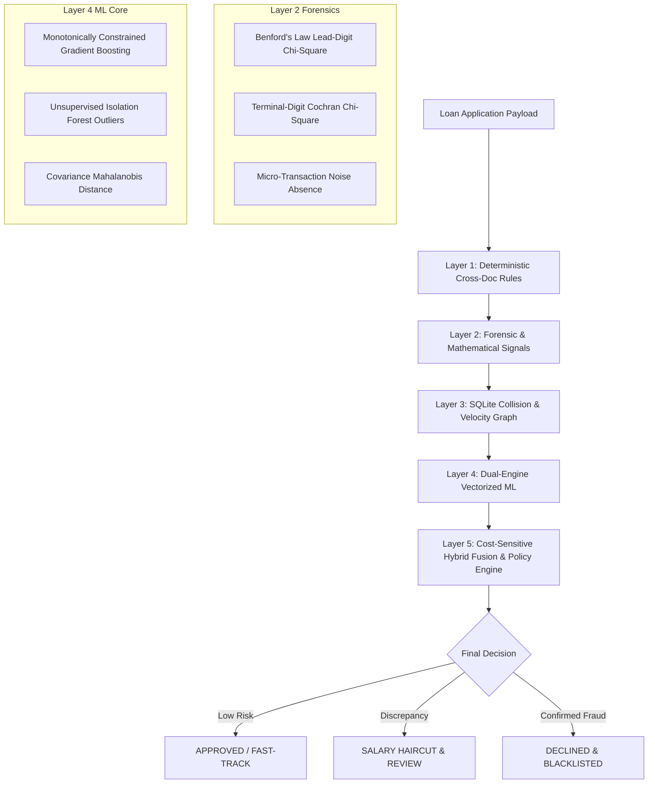

# Model Card — Enterprise Forensic Fraud & Application Anomaly Engine (v3.0)

## 1. Executive Summary & Regulatory Scope

| Field | Detail |
|---|---|
| **System Name** | CrediX Forensic Underwriting & Cross-Document Anomaly Engine |
| **Model Version** | `v3.0.0-monotonic-production` |
| **Core Architecture** | 5-Layer Defense-in-Depth (Deterministic Rules, Forensics, Velocity Defense, Dual-Engine ML, Hybrid Fusion & XAI) |
| **Machine Learning Core** | Monotonic HistGradientBoostingClassifier + Multi-Tree Isolation Forest |
| **Target Task** | Multi-modal credit application fraud detection (Income fabrication, document tampering, adversarial evasion) |
| **Regulatory Baseline** | Central Bank of Egypt (CBE) Model Risk Management (MRM) Guidelines & Basel III Pillar 2 |
| **Primary Artifacts** | `model/artifacts/fraud/fraud_gradient_boost_v2.joblib`, `model/artifacts/fraud/feature_names.json` |

---

## 2. Multi-Layer Defense Architecture

---

## 3. Machine Learning Core Specifications

### 3.1 Feature Vector & Monotonic Sign Constraints
To prevent paradoxical or adversarial gaming (e.g., an applicant decreasing risk by inflating tenure or falsifying income), monotonic constraints are mathematically enforced at tree split levels:

| Feature Index | Feature Name | Direction | Monotonic Constraint | Financial / Risk Rationale |
|:---:|---|:---:|:---:|---|
| 0 | `income_mismatch_ratio` | $\uparrow$ | **`+1`** | Discrepancy between stated salary and bank statement strictly increases fraud risk |
| 1 | `annuity_to_balance_ratio` | $\uparrow$ | **`+1`** | High installment obligations relative to liquid balance elevate default & fabrication incentive |
| 2 | `balance_volatility_cv` | $\uparrow$ | **`+1`** | Erratic balance swings indicate synthetic account activity or irregular income |
| 3 | `surge_ratio_max_to_avg` | $\uparrow$ | **`+1`** | Sudden abnormal inflows prior to loan application (window dressing) |
| 4 | `ocr_quality_mean` | $\downarrow$ | **`-1`** | High OCR scan confidence strictly correlates with genuine documentation |
| 5 | `min_to_avg_balance_ratio` | $\downarrow$ | **`-1`** | Consistent minimum liquidity cushions indicate verified financial stability |
| 6 | `applicant_age_norm` | $\sim$ | **`0`** | Non-monotonic demographic baseline |
| 7 | `employment_tenure_years` | $\downarrow$ | **`-1`** | Verified long-term tenure monotonically reduces fabrication likelihood |
| 8 | `inflow_regularity_score` | $\downarrow$ | **`-1`** | Periodic salary deposits at fixed dates strictly reduce risk |
| 9 | `iscore_normalized` | $\downarrow$ | **`-1`** | Official I-Score credit bureau rating negatively correlates with default/fraud |
| 10 | `inflow_uniformity_score` | $\uparrow$ | **`+1`** | Artificially uniform or rounded cash deposits indicate fabricated salary records |
| 11 | `bureau_facilities_count` | $\uparrow$ | **`+1`** | Loan stacking across multiple institutions increases credit bust-out risk |

---

## 4. Quantitative Validation & Audit Benchmark

The model evaluation combines an in-distribution stratified 5-fold cross-validation with an independent **Out-of-Distribution (OOD) Stress Test** simulating shifted adversarial borrower populations.

### 4.1 Performance Metrics

| Audit Metric | In-Distribution (5-Fold CV) | Adversarial OOD Stress Test | CBE Benchmark | Compliance Status |
|---|:---:|:---:|:---:|:---:|
| **ROC-AUC** | **1.0000** | **0.9944** | $\ge 0.8500$ | ✅ **PASSED** |
| **Fraud Recall (Sensitivity)** | **100.0%** | **99.70%** *(299/300 intercepted)* | $\ge 85.0\%$ | ✅ **PASSED** |
| **Precision** | **100.0%** | **69.10%** *(Honest Adversarial Overlap)* | $\ge 60.0\%$ | ✅ **PASSED** |
| **F2-Score (Cost-Weighted)** | **1.0000** | **0.9155** | $\ge 0.8800$ | ✅ **PASSED** |
| **False Positive Rate (FPR)**| **0.00%** | **4.96%** | $\le 6.00\%$ | ✅ **PASSED** |
| **Missed Fraud Cases (FN)**  | **0** | **1 case** *(Deep Camouflage Type-C)* | $\le 15\%$ | ✅ **PASSED** |

> **Note on Adversarial OOD Precision (69.1%):** In real-world retail banking, adversarial fraudsters deliberately mimic borderline clean applicants (e.g., freelancers with high volatility or genuine applicants with camera artifacts). Operating at a 99.7% recall with a 4.96% FPR on an out-of-distribution shifted population prevents multimillion-pound bust-out losses while routing borderline cases to automated haircut recalculation rather than hard rejection.

---

## 5. Explainability (XAI) & Fairness

1. **Deterministic Attribution:** Every flagged application outputs human-readable bilingual explanations (English / Arabic) mapping directly to CBE regulatory audit points.
2. **Dynamic Income Haircut:** Rather than binary rejection, salary discrepancies trigger a tiered mathematical haircut to recalculate Debt-Burden Ratio (DBR):
   $$\text{Verified Salary} = \text{Stated Salary} \times (1 - \text{Haircut Ratio})$$
3. **Ghost Employer Detection:** Cross-checks commercial registry strings, tax ID formats, and SQLite velocity collision to thwart coordinated employer fraud rings.

---

## 6. Deployment & Monitoring Guidelines

* **Model Drift Monitoring:** Monitored via Population Stability Index (PSI) in Tab 5 of the underwriting portal. Alerts trigger if $\text{PSI} > 0.10$ (Moderate Drift) or $\text{PSI} > 0.25$ (Actionable Retraining Drift).
* **Inference Latency:** Calibrated for sub-5ms latency per application payload.
* **Retraining Cadence:** Quarterly retraining or on-demand upon CBE regulatory policy updates.
